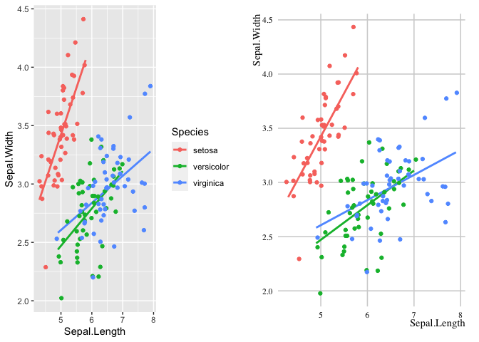

<!-- README.md is generated from README.Rmd. Please edit that file -->

# tidyMB

<!-- badges: start -->

[](https://www.tidyverse.org/lifecycle/#experimental)
[](https://CRAN.R-project.org/package=tidyMB)
<!-- badges: end -->

The goal of tidyMB is to provide opinionated table, figure, and .Rmd
templates and styles used in the Motivation and Behaviour program at
Institute for Positive Psychology and Education, Australian Catholic
University.

## Installation

The development version from [GitHub](https://github.com/) with:

``` r
# install.packages("devtools")
devtools::install_github("Motivation-and-Behaviour/tidyMB")
```

## Example plot comparing default with theme\_mnb

``` r
library(tidyMB)
suppressPackageStartupMessages(library(tidyverse))
## Then use the + mnb on your plots ##
original <- iris %>% 
  ggplot(aes(x = Sepal.Length, y = Sepal.Width, col = Species)) +
        geom_smooth(method = "lm", se = F) +
        geom_jitter()
mnb_version <- original + theme_mb()
require(gridExtra)
#> Loading required package: gridExtra
#> 
#> Attaching package: 'gridExtra'
#> The following object is masked from 'package:dplyr':
#> 
#>     combine
grid.arrange(original, mnb_version, ncol = 2)
#> `geom_smooth()` using formula 'y ~ x'
#> `geom_smooth()` using formula 'y ~ x'
```


